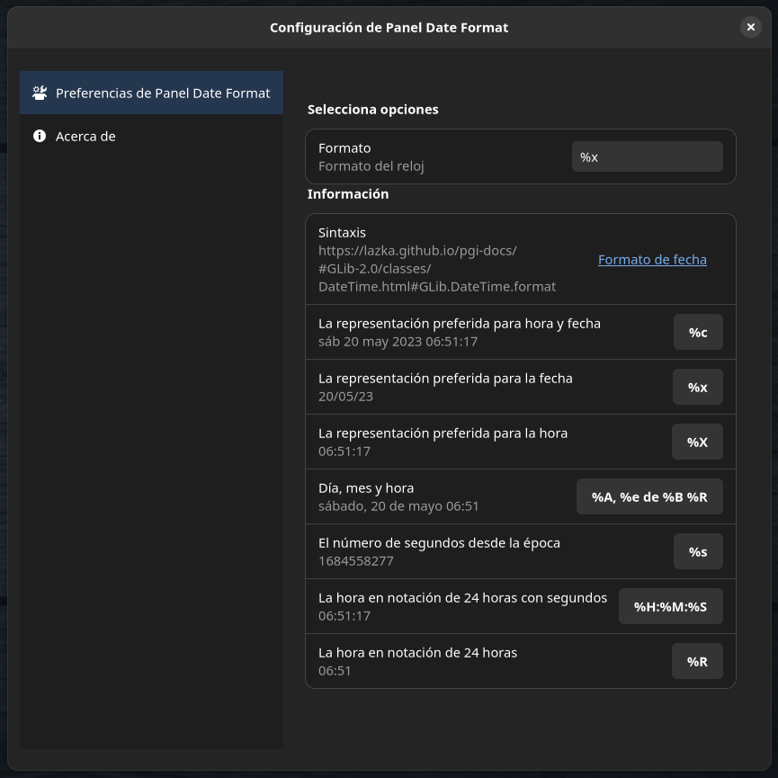

<!-- start project-info -->
<!--
project_title: Panel Date Format
github_project: https://github.com/atareao/gnome-shell-panel-date-format
license: MIT
icon: /datos/Sync/Programacion/gnome-shell/panel-date-format@atareao.es/icons/panel-date-format.png
homepage: https://www.atareao.es
license-badge: True
contributors-badge: True
lastcommit-badge: True
codefactor-badge: True
--->

<!-- end project-info -->

<!-- start badges -->

<!-- end badges -->

<!-- start description -->
This is a simple extension for GNOME Shell that allows to customize the date format on the panel
<!-- end description -->

<!-- start prerequisites -->
## Prerequisites

Before you begin, ensure you have met the following requirements:

* If you install it from PPA don't worry about, becouse all the requirements are included in the package
* If you clone the repository, you need, at least, these dependecies,
<!-- end prerequisites -->

<!-- start installing -->
## Installing Panel Date Format

If you wanna add this extension to your desktop, get it from [GNOME Shell extensions](https://extensions.gnome.org)
<!-- end installing -->

<!-- start using -->
## Using Panel Date Format

After installing you must enable it with extensions applications and after that in the confiuration set your prefered format

<!-- end using -->

<!-- start contributing -->
## Contributing to Ubuntu First Steps

To contribute to **Ubuntu First Steps**, follow these steps:

1. Fork this repository.
2. Create a branch: `git checkout -b <branch_name>`.
3. Make your changes and commit them: `git commit -m '<commit_message>'`
4. Push to the original branch: `git push origin <project_name>/<location>`
5. Create the pull request.

Alternatively see the GitHub documentation on [creating a pull request](https://help.github.com/en/github/collaborating-with-issues-and-pull-requests/creating-a-pull-request).
</location></project_name></commit_message></branch_name>
<!-- end contributing -->

<!-- start contributors -->
## 👤 Contributors ✨

Thanks goes to these wonderful people ([emoji key](https://allcontributors.org/docs/en/emoji-key)):
<!-- end contributors -->

<!-- start table-contributors -->

<table id="contributors">
	<tr id="info_avatar">
		<td id="atareao" align="center">
			
		</td>
		<td id="KEIII" align="center">
			
		</td>
	</tr>
	<tr id="info_name">
		<td id="atareao" align="center">
			<a href="https://github.com/atareao">
				<strong>Lorenzo Carbonell</strong>
			</a>
		</td>
		<td id="KEIII" align="center">
			<a href="https://github.com/KEIII">
				<strong>Ivan Kasenkov</strong>
			</a>
		</td>
	</tr>
	<tr id="info_commit">
		<td id="atareao" align="center">
			<a href="/commits?author=atareao">
				💻
			</a>
		</td>
		<td id="KEIII" align="center">
			<a href="/commits?author=KEIII">
				💻
			</a>
		</td>
	</tr>
</table>
<!-- end table-contributors -->
